# 🏠 Home Lab Raspberry Pi Cluster

A complete Infrastructure as Code (IaC) solution for deploying a Kubernetes cluster on Raspberry Pi hardware with automated setup via Ansible and Helm.

## 📋 Table of Contents

- [Overview](#overview)
- [Hardware](#hardware)
- [Architecture](#architecture)
- [Services](#services)
- [Prerequisites](#prerequisites)
- [Quick Start](#quick-start)
- [Detailed Setup Guide](#detailed-setup-guide)
- [Project Structure](#project-structure)
- [Configuration](#configuration)
- [Deployment](#deployment)
- [Usage](#usage)
- [Maintenance](#maintenance)
- [Troubleshooting](#troubleshooting)
- [Future Upgrades](#future-upgrades)

---

## 🎯 Overview

This project deploys a Kubernetes cluster on Raspberry Pi hardware using:

- **K3s**: Lightweight Kubernetes distribution optimized for ARM64
- **Ansible**: Automated configuration and cluster deployment
- **Helm**: Kubernetes package management
- **NFS**: Shared persistent storage across the cluster

**Key Features:**
- Automated infrastructure provisioning with Ansible
- OS hardening and kernel tuning for embedded hardware
- Dynamic volume provisioning for stateful workloads
- Complete monitoring stack (Prometheus & Grafana)
- Network-wide services (Pi-hole, Home Assistant, N8n)

---

## 🔧 Hardware

### Cluster Composition

| Component | Specification | OS |
|-----------|---------------|-----|
| **Master Node** | 1x Raspberry Pi 4 (4GB RAM) | Ubuntu LTS (64-bit) |
| **Worker Nodes** | 2x Raspberry Pi 3 Model B (512MB RAM) | Raspberry Pi OS Lite (64-bit) |
| **Storage** | USB Flash Drive (64GB+) / Future: Pi 5 NAS | N/A |
| **Network** | Ethernet switch or router (3+ ports) | N/A |

### Optional Hardware

- Raspberry Pi cluster case
- Cooling fans (recommended for Pi 4)
- PoE HATs (for PoE switch)
- Ethernet cables (Cat5e or better)

---

## 🏗️ Architecture

```mermaid
graph TD
    subgraph cluster["Home Lab Cluster"]
        master["<b>Pi 4 (Master)</b><br/>192.168.X.XX<br/><br/>• K3s Control Plane<br/>• etcd<br/>• API Server<br/>• Scheduler"]
        
        storage["<b>Storage: USB Flash Drive</b><br/>/mnt/storage<br/>(NFS Server)<br/><br/>Network:<br/>(Future: Pi 5 NAS)"]
        
        worker1["<b>Pi 3 Worker1</b><br/>192.168.X.XX<br/><br/>• App Pods<br/>• Monitoring"]
        
        worker2["<b>Pi 3 Worker2</b><br/>192.168.X.XX<br/><br/>• App Pods<br/>• Monitoring"]
        
        master -->|Mount| storage
        master -->|Kubernetes Control| worker1
        master -->|Kubernetes Control| worker2
    end
    
    style master fill:#e1f5ff,stroke:#01579b,stroke-width:2px,color:#000
    style storage fill:#fff3e0,stroke:#e65100,stroke-width:2px,color:#000
    style worker1 fill:#f3e5f5,stroke:#4a148c,stroke-width:2px,color:#000
    style worker2 fill:#f3e5f5,stroke:#4a148c,stroke-width:2px,color:#000
    style cluster fill:#fafafa,stroke:#333,stroke-width:3px,color:#000
```

<details>
<summary>📊 Cluster Architecture Diagram</summary>


</details>

### Storage Architecture

**Current (Phase 1):**
```
Pi 4 Master + USB Drive → NFS Server → Workers mount NFS
```

**Future (Phase 2):**
```
Pi 5 NAS (Independent) → NFS/iSCSI → All cluster nodes
```

---

## 🚀 Services

### Core Applications

| Service | Purpose | Access |
|---------|---------|--------|
| **Pi-hole** | Network-wide ad blocking & DNS | http://10.0.0.100/admin |
| **Home Assistant** | Home automation platform | http://10.0.0.101:8123 |
| **N8n** | Workflow automation (IFTTT alternative) | http://10.0.0.102:5678 |
| **Prometheus** | Metrics collection & storage | http://10.0.0.154:30090 |
| **Grafana** | Metrics visualization & dashboards | http://10.0.0.154:30080 |

### System Services

- **K3s**: Lightweight Kubernetes distribution
- **NFS Provisioner**: Dynamic persistent volume provisioning
- **MetalLB** (optional): Load balancer for bare metal

---

## 📦 Prerequisites

### System Requirements

- **OS**: Linux (Ubuntu/Debian or similar)
- **Ansible**: 2.10+
- **Git**: Latest version
- **ssh-pass**: For Ansible password authentication

### Installation

#### Ubuntu/Debian
```bash
sudo apt update && sudo apt install -y ansible git sshpass net-tools
```

### Software Versions

| Software | Version |
|----------|---------|
| Ansible | 2.10+ |
| Raspberry Pi OS Lite | 64-bit (latest) |
| K3s | Latest stable (installed via script) |
| Helm | 3.x (installed during setup) |
| Ubuntu LTS | 22.04+ (64-bit) |

---

## 🏁 Quick Start

### Step 1: Clone Repository
```bash
git clone https://github.com/isri12/homelab-pi-cluster.git
cd homelab-pi-cluster
```

### Step 2: Flash SD Cards

Use Raspberry Pi Imager to flash all 3 SD cards with:

- **OS**: Ubuntu Server LTS (64-bit) for master, Raspberry Pi OS Lite (64-bit) for workers
- **SSH**: Enabled
- **Username**: `pi` (temporary)
- **Password**: Your chosen password
- **Hostname**: `raspberrypi` (will be changed by Ansible)

### Step 3: Configure Inventory

Edit your Pi IP addresses:

```bash
nano ansible/inventory/hosts.yml
```

### Step 4: Setup Ansible Vault

Create encrypted credentials:

```bash
# Create vault file
ansible-vault create ansible/inventory/group_vars/all/vault.yml

# View vault file
ansible-vault view ansible/inventory/group_vars/all/vault.yml

# Edit vault file
ansible-vault edit ansible/inventory/group_vars/all/vault.yml
```

### Step 5: Test Ansible Connection

```bash
ansible all -i ansible/inventory/hosts.yml -m ping --ask-vault-pass
```

### Step 6: Run Automated Setup

```bash
# Complete setup (20-30 minutes)
./scripts/setup-cluster.sh

# Or run playbooks individually:
ansible-playbook -i ansible/inventory/hosts.yml ansible/playbooks/01-prepare-pis.yml --ask-vault-pass
ansible-playbook -i ansible/inventory/hosts.yml ansible/playbooks/02-install-k3s.yml --ask-vault-pass
ansible-playbook -i ansible/inventory/hosts.yml ansible/playbooks/03-setup-storage.yml --ask-vault-pass
```

### Step 7: Reboot Workers

```bash
ansible workers -i ansible/inventory/hosts.yml -b -m reboot --ask-vault-pass
```

### Step 8: Access Services

After deployment, access your services at:

| Service | URL |
|---------|-----|
| Grafana | http://192.168.1.10:30080 |
| Pi-hole | http://192.168.1.100/admin |
| Home Assistant | http://192.168.1.101:8123 |
| N8n | http://192.168.1.102:5678 |

---

## 📚 Detailed Setup Guide

### Finding Pi IP Addresses

**Option A: Check Router's DHCP List**
- Log into your router admin panel
- Check connected devices

**Option B: Network Scan**
```bash
# macOS/Linux
sudo nmap -sn 192.168.1.0/24 | grep -B 2 "Raspberry"

# Or check ARP table
arp -a | grep -i "b8:27:eb\|dc:a6:32\|e4:5f:01"
```

**Option C: Use Hostname**
```bash
ssh pi@raspberrypi.local
```

### Verify SSH Access

```bash
# Test each Pi
ssh pi@192.168.1.XX
ssh pi@192.168.1.XX
ssh pi@192.168.1.XX
```

### Prepare USB Storage

1. Insert USB flash drive into Pi 4
2. Identify the device:
```bash
ssh pi@192.168.1.XX
lsblk  # Look for your USB drive (usually /dev/sda)
```

The Ansible playbook will format and mount it automatically.

### Run Ansible Playbooks

#### Playbook 1: Prepare Pis (10-15 minutes)

```bash
ansible-playbook -i ansible/inventory/hosts.yml ansible/playbooks/01-prepare-pis.yml --ask-vault-pass
```

**What it does:**
- Updates all packages
- Installs required software
- Sets hostnames
- Enables cgroups for Kubernetes
- Disables swap
- Reboots if needed

#### Playbook 2: Install K3s (5-10 minutes)

```bash
ansible-playbook -i ansible/inventory/hosts.yml ansible/playbooks/02-install-k3s.yml --ask-vault-pass
```

**What it does:**
- Installs K3s on master node
- Installs K3s agents on worker nodes
- Retrieves kubeconfig
- Verifies cluster is ready

#### Playbook 3: Setup Storage (2-5 minutes)

```bash
ansible-playbook -i ansible/inventory/hosts.yml ansible/playbooks/03-setup-storage.yml --ask-vault-pass
```

**What it does:**
- Formats USB drive (ext4)
- Mounts storage on master
- Configures NFS server
- Mounts NFS on workers
- Creates storage directories

### Configure K3s Storage Path

Edit K3s configuration on the master node:

```bash
sudo nano /etc/systemd/system/k3s.service
```

Update the ExecStart line to include:

```
ExecStart=/usr/local/bin/k3s \
    server \
    --write-kubeconfig-mode 644 \
    --default-local-storage-path /mnt/storage
```

**Flag Explanations:**
- `--write-kubeconfig-mode 644`: Allows users to run kubectl without sudo
- `--default-local-storage-path /mnt/storage`: Uses custom storage for persistent volumes

Apply changes:

```bash
sudo systemctl daemon-reload
sudo systemctl restart k3s
sudo systemctl status k3s
```

### NFS Server Setup

#### Install NFS Server (on Pi 4 Master)

```bash
sudo apt update && sudo apt install nfs-kernel-server -y
```

#### Configure NFS Export

Edit `/etc/exports`:

```bash
sudo nano /etc/exports
```

Add this line:

```
/mnt/storage *(rw,sync,no_subtree_check,no_root_squash)
```

> **Note:** `*` allows all IPs. For better security, use your cluster subnet like `192.168.1.0/24`

#### Apply NFS Configuration

```bash
sudo exportfs -a
sudo systemctl restart nfs-kernel-server
```

### Deploy NFS Provisioner

```bash
# Clone repository if not already done
cd homelab-pi-cluster

# Deploy NFS provisioner
kubectl apply -f kubernetes/storage/nfs-provisioner.yaml

# Wait for deployment to be ready
kubectl wait --for=condition=available --timeout=300s \
  deployment/nfs-client-provisioner -n nfs-provisioner

# Verify
kubectl get pods -n nfs-provisioner
kubectl get storageclass

# Set nfs-client as default storage class
kubectl patch storageclass local-path -p '{"metadata": {"annotations":{"storageclass.kubernetes.io/is-default-class":"false"}}}'
```

### Install Helm & Add Repositories

```bash
# Install Helm
curl https://raw.githubusercontent.com/helm/helm/main/scripts/get-helm-3 | bash

# Add Helm repositories
helm repo add prometheus-community https://prometheus-community.github.io/helm-charts
helm repo add grafana https://grafana.github.io/helm-charts
helm repo add mojo2600 https://mojo2600.github.io
helm repo add bjw-s https://bjw-s-labs.github.io/helm-charts
helm repo add pajikos http://pajikos.github.io/home-assistant-helm-chart/
helm repo update
```

### Deploy Applications

#### Deploy Monitoring Stack

```bash
kubectl create namespace monitoring
helm install kube-prometheus prometheus-community/kube-prometheus-stack \
  --namespace monitoring \
  -f helm-values/prometheus-stack-values.yaml \
  --wait
```

#### Deploy Pi-hole

```bash
kubectl create namespace pihole
helm install pihole mojo2600/pihole \
  --namespace pihole \
  -f helm-values/pihole-values.yaml \
  --wait
```

#### Deploy Home Assistant

```bash
kubectl create namespace home
helm install home-assistant k8s-at-home/home-assistant \
  --namespace home \
  -f helm-values/home-assistant-values.yaml \
  --wait
```

#### Deploy N8n

```bash
kubectl apply -f kubernetes/apps/n8n/deployment.yaml
```

### Verify Deployment

```bash
# Check cluster status
kubectl cluster-info
kubectl get nodes -o wide

# Check all pods
kubectl get pods --all-namespaces

# Check storage
kubectl get pvc --all-namespaces
kubectl get storageclass

# Check services
kubectl get svc --all-namespaces

# Watch pods being created
watch -n 2 'kubectl get pods -A'
```


## 📁 Project Structure

```
homelab-pi-cluster/
├── README.md                          # Main documentation
├── details.md                         # Detailed setup guide (this file)
├── .gitignore
│
├── ansible/                           # Ansible automation
│   ├── inventory/
│   │   ├── hosts.yml                  # Inventory with Pi IPs
│   │   └── group_vars/
│   │       └── all/
│   │           └── vault.yml          # Encrypted credentials
│   ├── playbooks/
│   │   ├── 01-prepare-pis.yml         # Initial Pi setup
│   │   ├── 02-install-k3s.yml         # K3s installation
│   │   ├── 03-setup-storage.yml       # Storage configuration
│   │   ├── 00-crash-loop.yaml         # Crash loop fixes
│   │   └── fix-cgroups-workers.yml    # Cgroup configuration
│   └── roles/                         # Custom Ansible roles
│
├── kubernetes/                        # Kubernetes manifests
│   ├── storage/
│   │   └── nfs-provisioner.yaml       # NFS provisioner deployment
│   └── apps/
│       ├── pihole/                    # Pi-hole Kubernetes configs
│       ├── home-assistant/            # Home Assistant configs
│       ├── n8n/                       # N8n automation configs
│       │   └── deployment.yaml
│       └── monitoring/                # Monitoring stack configs
│
├── helm-values/                       # Helm chart custom values
│   ├── prometheus-stack-values.yaml   # Prometheus & Grafana config
│   ├── pihole-values.yaml             # Pi-hole Helm values
│   └── home-assistant-values.yaml     # Home Assistant Helm values
│
├── scripts/                           # Utility scripts
│   ├── setup-cluster.sh               # Complete automation script
│   ├── deploy-app.sh                  # Deploy individual apps
│   ├── deploy-with-docker.sh          # Docker-based deployment
│   ├── check-cluster.sh               # Cluster health check
│   └── check-c-group-issue.sh         # Cgroup diagnostics
│
├── docs/                              # Documentation files
├── kubeconfig                         # Kubernetes config (generated)
└── kubernetes/                        # Kubernetes configs
```

---

## ⚙️ Configuration

### Ansible Inventory

Edit [ansible/inventory/hosts.yml](ansible/inventory/hosts.yml):

```yaml
all:
  vars:
    ansible_user: pi
    ansible_become_password: "your-password"
    
  children:
    master:
      hosts:
        pi-master:
          ansible_host: 192.168.1.10
          node_ip: 192.168.1.10
    
    workers:
      hosts:
        pi-worker1:
          ansible_host: 192.168.1.11
        pi-worker2:
          ansible_host: 192.168.1.12
```

### Storage Configuration

Edit [ansible/playbooks/03-setup-storage.yml](ansible/playbooks/03-setup-storage.yml):

```yaml
vars:
  usb_device: /dev/sda1              # USB drive device path
  mount_point: /mnt/storage          # Where to mount storage
  nfs_export_network: 192.168.1.0/24 # Your cluster network
```

### Service Configuration

#### Prometheus & Grafana

Edit [helm-values/prometheus-stack-values.yaml](helm-values/prometheus-stack-values.yaml):

```yaml
grafana:
  adminPassword: "your-secure-password"  # Change this!
  persistence:
    size: 5Gi
    storageClassName: nfs-client
```

#### Pi-hole

Edit [helm-values/pihole-values.yaml](helm-values/pihole-values.yaml):

```yaml
serviceDns:
  loadBalancerIP: 192.168.1.100      # Desired IP for Pi-hole
adminPassword: "your-secure-password"
```

#### Home Assistant

Edit [helm-values/home-assistant-values.yaml](helm-values/home-assistant-values.yaml):

```yaml
service:
  main:
    loadBalancerIP: 192.168.1.101     # Desired IP for Home Assistant
    type: LoadBalancer
```

---

## 🚀 Deployment

### Automated Deployment

```bash
# Complete setup in one command (20-30 minutes total)
./scripts/setup-cluster.sh
```

### Manual Deployment

```bash
# Step 1: Prepare all Pis
ansible-playbook -i ansible/inventory/hosts.yml ansible/playbooks/01-prepare-pis.yml --ask-vault-pass

# Step 2: Install K3s
ansible-playbook -i ansible/inventory/hosts.yml ansible/playbooks/02-install-k3s.yml --ask-vault-pass

# Step 3: Setup storage
ansible-playbook -i ansible/inventory/hosts.yml ansible/playbooks/03-setup-storage.yml --ask-vault-pass

# Step 4: Deploy NFS provisioner
kubectl apply -f kubernetes/storage/nfs-provisioner.yaml

# Step 5: Deploy applications
./scripts/deploy-with-docker.sh
```

### Deployment Verification

```bash
# Check cluster health
kubectl cluster-info
kubectl get nodes -o wide

# Check all pods are running
kubectl get pods --all-namespaces

# Check persistent volumes and claims
kubectl get pvc --all-namespaces
kubectl get storageclass

# Check all services
kubectl get svc --all-namespaces

# Monitor pod creation
watch -n 2 'kubectl get pods -A'
```

---

## 💻 Usage

### Accessing Services

#### Credentials Table

| Service | URL | Username | Password | Notes |
|---------|-----|----------|----------|-------|
| **Grafana** | http://10.0.0.154:30080 | admin | changeme123 | Change immediately! |
| **Pi-hole** | http://10.0.0.100/admin | — | changeme123 | DNS blocking & admin |
| **Home Assistant** | http://10.0.0.101:8123 | — | — | First-time setup wizard |
| **N8n** | http://10.0.0.102:5678 | admin | changeme123 | Workflow automation |
| **Prometheus** | http://10.0.0.154:30090 | — | — | No authentication |

> ⚠️ **Security Warning:** Change all default passwords after initial setup!

### Common Kubernetes Commands

#### Cluster Information
```bash
# Get cluster info
kubectl cluster-info

# View nodes
kubectl get nodes -o wide

# View all resources
kubectl get all --all-namespaces
```

#### Pod & Deployment Management
```bash
# View logs
kubectl logs -n monitoring deployment/kube-prometheus-stack-grafana

# Execute commands in pod
kubectl exec -it -n home pod/home-assistant-xxx -- /bin/bash

# Scale deployment
kubectl scale deployment home-assistant -n home --replicas=2

# Restart deployment
kubectl rollout restart deployment/home-assistant -n home
```

#### Port Forwarding & Access
```bash
# Port forward to access service locally
kubectl port-forward -n monitoring svc/kube-prometheus-stack-grafana 3000:80

# Connect to pod shell
kubectl exec -it -n pihole <pod-name> -- /bin/bash
```

### Kubeconfig Setup

Copy kubeconfig to your local machine:

```bash
# Copy from Pi 4
scp pi@192.168.1.10:/etc/rancher/k3s/k3s.yaml ~/.kube/config

# Update server address to use Pi IP instead of localhost
sed -i 's/127.0.0.1/192.168.1.10/g' ~/.kube/config

# Test connectivity
kubectl get nodes
```

### Accessing Pi-hole

#### Via Web UI
1. Open browser: http://10.0.0.100/admin
2. Login with password from settings

#### Change Admin Password
```bash
# SSH to master node
ssh isri@10.0.0.154

# Get Pi-hole pod name
kubectl get pods -n pihole

# Execute into container
kubectl exec -it -n pihole pihole-xxxxxxxxxx-xxxxx -- /bin/bash

# Change password
pihole -a -p

# Exit
exit
```

### Grafana Setup

#### Access Grafana
1. Open: http://10.0.0.154:30080
2. Login: admin/changeme123

#### Configure Prometheus Data Source
1. Click "Connections" → "Data sources"
2. Click "Add data source"
3. Select "Prometheus"
4. Set URL to: `http://prometheus.monitoring.svc.cluster.local:9090`
5. Click "Save & Test"

#### Pre-installed Dashboards
- Kubernetes / Compute Resources / Cluster
- Kubernetes / Compute Resources / Node
- Node Exporter / Nodes

---

## 🔧 Maintenance

### Cluster Updates

```bash
# Update all system packages
ansible-playbook -i ansible/inventory/hosts.yml ansible/playbooks/01-prepare-pis.yml --ask-vault-pass

# Upgrade K3s
ansible all -i ansible/inventory/hosts.yml -m shell \
  -a "curl -sfL https://get.k3s.io | sh -" -b --ask-vault-pass
```

### Monitoring Cluster Health

#### Check Resource Usage
```bash
# Node resource consumption
kubectl top nodes

# Pod resource consumption
kubectl top pods --all-namespaces

# Disk space usage
ansible all -i ansible/inventory/hosts.yml -a "df -h"

# Memory usage
ansible all -i ansible/inventory/hosts.yml -a "free -h"
```

#### View Logs
```bash
# K3s logs on master
ssh pi@192.168.1.10
sudo journalctl -u k3s -f

# Application logs
kubectl logs -n home deployment/home-assistant --tail=100 -f

# All cluster events
kubectl get events --all-namespaces --sort-by='.lastTimestamp'
```

### Backup & Recovery

#### Backup Storage Data
```bash
# Manual backup (run on master)
ssh pi@192.168.1.10
sudo rsync -av /mnt/storage/ /mnt/storage/backups/$(date +%Y%m%d)/
```

#### Backup etcd
```bash
ssh pi@192.168.1.10
sudo k3s etcd-snapshot save --name backup-$(date +%Y%m%d)
```

### Disk Space Management

```bash
# Check available space on all nodes
ansible all -i ansible/inventory/hosts.yml -a "df -h"

# Check NFS storage usage
ssh pi@192.168.1.10
du -sh /mnt/storage/*

# Clean old Docker images (if using Docker)
ansible all -i ansible/inventory/hosts.yml -a "docker image prune -a"
```

---

## 🔍 Troubleshooting

### Ansible Connection Issues

**Problem:** `ansible all -m ping` fails

```bash
# Check SSH access manually
ssh pi@192.168.1.10

# Verify IP addresses in inventory
cat ansible/inventory/hosts.yml

# Reset SSH key cache
ssh-keygen -R 192.168.1.10

# Test with verbose output
ansible all -i ansible/inventory/hosts.yml -m ping --ask-vault-pass -vvv
```

### K3s Installation Issues

**Problem:** K3s fails to start or crashes

```bash
# Check K3s logs
ssh pi@192.168.1.10
sudo journalctl -u k3s -n 100

# Verify cgroups are enabled
cat /proc/cgroups

# Check if swap is disabled (required for K3s)
free -h

# Reinstall K3s
curl -sfL https://get.k3s.io | sh -

# Check service status
sudo systemctl status k3s
```

### Storage Issues

**Problem:** Pods stuck in "Pending" state

```bash
# Check PVC status
kubectl get pvc --all-namespaces

# Check NFS provisioner
kubectl get pods -n nfs-provisioner
kubectl logs -n nfs-provisioner deployment/nfs-client-provisioner

# Describe the pending pod for error details
kubectl describe pod <pod-name> -n <namespace>

# Test NFS mount manually (from worker node)
ssh pi@192.168.1.11
sudo mount 192.168.1.10:/mnt/storage /mnt/test
mount | grep storage
sudo umount /mnt/test
```

**Problem:** USB drive not mounting

```bash
ssh pi@192.168.1.10

# Check if drive is detected
lsblk

# Check current mounts
mount | grep storage

# Check /etc/fstab configuration
cat /etc/fstab

# Manually remount
sudo mount -a
```

### Pod Issues

**Problem:** Pod won't start or keeps restarting

```bash
# Get detailed pod information
kubectl describe pod <pod-name> -n <namespace>

# Check events for error details
kubectl get events -n <namespace> --sort-by='.lastTimestamp'

# View pod logs
kubectl logs <pod-name> -n <namespace>
kubectl logs <pod-name> -n <namespace> --previous  # For crashed pods

# Delete and recreate pod
kubectl delete pod <pod-name> -n <namespace>
```

**Problem:** Out of memory on Pi 3 workers

```bash
# Check memory usage
kubectl top nodes
kubectl top pods --all-namespaces

# Add node selector to schedule on Pi 4 instead
kubectl edit deployment <name> -n <namespace>
# Add:
#   spec:
#     template:
#       spec:
#         nodeSelector:
#           kubernetes.io/hostname: pi-master
```

### Network Issues

**Problem:** Can't access services from outside cluster

```bash
# Check service IPs and types
kubectl get svc --all-namespaces

# Check if MetalLB is working (if installed)
kubectl get pods -n metallb-system

# Test from master node
ssh pi@192.168.1.10
curl -v http://192.168.1.100  # Test Pi-hole
curl -v http://192.168.1.101:8123  # Test Home Assistant

# Check DNS resolution
nslookup home-assistant.home.svc.cluster.local
```

### Cgroup Issues

**Problem:** Cgroup v2 memory controller errors

```bash
# Check cgroup version
cat /proc/cgroups

# Fix cgroup issues on workers
ansible-playbook -i ansible/inventory/hosts.yml ansible/playbooks/fix-cgroups-workers.yml --ask-vault-pass

# Reboot workers
ansible workers -i ansible/inventory/hosts.yml -b -m reboot --ask-vault-pass
```

### General Debugging Commands

```bash
# Full cluster status
kubectl get all --all-namespaces

# Describe any resource
kubectl describe <resource-type> <name> -n <namespace>

# Get detailed resource info
kubectl get <resource> <name> -n <namespace> -o yaml

# Check node status
kubectl describe node pi-master

# Force delete stuck resources
kubectl delete pod <pod-name> -n <namespace> --grace-period=0 --force

# Restart entire deployment
kubectl rollout restart deployment/<name> -n <namespace>
```

---

## 🔮 Future Upgrades

### Phase 2: Pi 5 NAS Integration

When ready to add a Pi 5 with NAS:

1. **Setup Pi 5 with TrueNAS or OpenMediaVault**
2. **Run migration playbook:**
   ```bash
   ./scripts/migrate-to-pi5-nas.sh
   ```

**What it does:**
- Mounts Pi 5 NAS on all nodes
- Migrates data from USB to NAS
- Updates NFS provisioner configuration
- Zero-downtime migration

### Potential Additions

- **Longhorn**: Distributed block storage for HA
- **Cert-Manager**: Automatic SSL certificate management
- **Traefik/Nginx Ingress**: Reverse proxy & load balancing
- **ArgoCD**: GitOps continuous deployment
- **Velero**: Automated backup and disaster recovery
- **Kubernetes Dashboard**: Web UI for cluster management
- **MinIO**: S3-compatible object storage
- **PostgreSQL/MySQL**: Database services
- **Redis**: In-memory data store
- **MQTT Broker**: IoT device communication

---

## 📞 Support & Resources

### Helpful Commands

```bash
# Quick cluster check
./scripts/check-cluster.sh

# Detailed diagnostics
kubectl describe node <node-name>
kubectl get events -A --sort-by='.lastTimestamp'

# Monitor in real-time
watch -n 2 'kubectl get pods -A'
watch kubectl top nodes
```

### Documentation Links

- [K3s Documentation](https://docs.k3s.io/)
- [Ansible Documentation](https://docs.ansible.com/)
- [Kubernetes Documentation](https://kubernetes.io/docs/)
- [Helm Documentation](https://helm.sh/docs/)
- [Raspberry Pi Documentation](https://www.raspberrypi.com/documentation/)

### Issues & Discussions

- **Issues**: Check [Issues.md](Issues.md) for known problems
- **Learning Path**: See [cka-learning-path.md](cka-learning-path.md) for CKA preparation

---

## 📝 License

This project is licensed under the MIT License.

## 🙏 Acknowledgments

- K3s team for lightweight Kubernetes
- Rancher for excellent K3s documentation
- Helm community for chart repositories
- Ansible community for automation tools
- Raspberry Pi Foundation for amazing hardware

---

**Built with ❤️ for learning Kubernetes and DevOps**

*Last Updated: February 2026*
