# Home Lab Raspberry Pi Cluster

Kubernetes cluster running on:
- 1x Pi 4 (Master)
- 2x Pi 3 b+ (Workers)

## Services
- Pi-hole
- Home Assistant
- N8n
- Grafana/Prometheus


# Home Lab Raspberry Pi Cluster

A complete Kubernetes home lab running on Raspberry Pi cluster with automated deployment using Ansible and Helm.

## 📋 Table of Contents

- [Overview](#overview)
- [Hardware Requirements](#hardware-requirements)
- [Architecture](#architecture)
- [Services](#services)
- [Prerequisites](#prerequisites)
- [Quick Start](#quick-start)
- [Detailed Setup Guide](#detailed-setup-guide)
- [Project Structure](#project-structure)
- [Configuration](#configuration)
- [Deployment](#deployment)
- [Usage](#usage)
- [Maintenance](#maintenance)
- [Troubleshooting](#troubleshooting)
- [Future Upgrades](#future-upgrades)
- [Contributing](#contributing)

## 🎯 Overview

Infrastructure as Code (IaC) solution for deploying a Kubernetes cluster on Raspberry Pi hardware. It uses:

- **K3s**: Lightweight Kubernetes distribution optimized for ARM
- **Ansible**: Automated configuration and cluster deployment
- **Helm**: Kubernetes package management
- **NFS**: Shared storage across the cluster

## 🔧 Hardware Used

### Required Hardware
- **1x Raspberry Pi 4 (4GB RAM)** - Master Node
   - Ubuntu LTS (64-bit)
- **2x Raspberry Pi 3 Model B (500M RAM)** - Worker Nodes
  - Raspberry Pi OS Lite (64-BIT)
- **1x NAS/ or any storage** (64GB+ for shared storage)
- **1x Network Switch** or router with 3+ Ethernet ports - Optional
- **3x Ethernet Cables** (Cat5e or better) - Optional 

### Optional Hardware
- **Raspberry Pi Cluster Case** (for better organization)
- **Cooling fans** (recommended for Pi 4)
- **PoE HATs** (if using PoE switch)

### Computer
- Linux

## 🏗️ Architecture

```mermaid
graph TD
    subgraph cluster["Home Lab Cluster"]
        master["<b>Pi 4 (Master)</b><br/>192.168.X.XX<br/><br/>• K3s Control Plane<br/>• etcd<br/>• API Server<br/>• Scheduler"]
        
        storage["<b>Storage: USB Flash Drive</b><br/>/mnt/storage<br/>(NFS Server)<br/><br/>Network:<br/>(FOR Future: Pi 5 NAS)"]
        
        worker1["<b>Pi 3 Worker1</b><br/>192.168.X.XX<br/><br/>• App Pods<br/>• Monitoring"]
        
        worker2["<b>Pi 3 Worker2</b><br/>192.168.X.XX<br/><br/>• App Pods<br/>• Monitoring"]
        
        master -->|Mount| storage
        master -->|Kubernetes Control| worker1
        master -->|Kubernetes Control| worker2
    end
    
    style master fill:#e1f5ff,stroke:#01579b,stroke-width:2px,color:#000
    style storage fill:#fff3e0,stroke:#e65100,stroke-width:2px,color:#000
    style worker1 fill:#f3e5f5,stroke:#4a148c,stroke-width:2px,color:#000
    style worker2 fill:#f3e5f5,stroke:#4a148c,stroke-width:2px,color:#000
    style cluster fill:#fafafa,stroke:#333,stroke-width:3px,color:#000
```

<details>
<summary>Click to view Cluster Architecture</summary>


</details>

### Storage Architecture

**Current (Phase 1):**
```
Pi 4 Master + USB Drive → NFS Server → Workers mount NFS
```

**Future (Phase 2):**
```
Pi 5 NAS (Independent) → NFS/iSCSI → All cluster nodes
```

## 🚀 Services

### Core Services
- **Pi-hole** - Network-wide ad blocking and DNS server
- **Home Assistant** - Home automation platform
- **N8n** - Workflow automation (IFTTT alternative)
- **Grafana** - Metrics visualization and dashboards
- **Prometheus** - Metrics collection and monitoring

### System Services
- **K3s** - Lightweight Kubernetes
- **NFS Provisioner** - Dynamic persistent volume provisioning
- **MetalLB** (optional) - Load balancer for bare metal

## 📦 Prerequisites

#### Ubuntu/Debian Linux
```bash
sudo apt update
sudo apt install -y ansible git
sudo apt install -y sshpass sudo sudo apt install -y net-tools
```

### Software Versions
- Ansible 2.10+
- Raspberry Pi OS Lite 64-bit (latest)
- K3s (installed via script - latest stable)
- Helm 3.x (installed during setup)

## 🏁 Quick Start

### 1. Clone This Repository
```bash
git clone https://github.com/isri12/homelab-pi-cluster.git
cd homelab-pi-cluster
```

### 2. Flash SD Cards and install ubuntu server LTS
Use Raspberry Pi Imager to flash all 3 SD cards with:
- **OS**: ubuntu server LTS (64-bit)
- **SSH**: Enabled
- **Username**: pi (TEMPORARY)
- **Password**: [your-password]
- **Hostname**: raspberrypi (TEMPORARY: will be changed by Ansible)

### 3. Configure Your Inventory

```bash
# Edit with your Pi IP addresses
nano ansible/inventory/hosts.yml
```

Create  ansible password cred. 
```bash
ansible-vault create ansible/inventory/group_vars/all/vault.yml
```

view
```bash
ansible-vault view ansible/inventory/group_vars/all/vault.yml
```

edit
```bash
ansible-vault edit ansible/inventory/group_vars/all/vault.yml
```

test
```bash
ansible all -i ansible/inventory/hosts.yml -m ping --ask-vault-pass
```

### 4. Test Ansible Connection
```bash
ansible all -i ansible/inventory/hosts.yml -m ping --ask-vault-pass
```


### 5. Run Automated Setup
```bash
# Complete setup (20-30 minutes)
./scripts/setup-cluster.sh

# Or run playbooks individually:
# ansible-playbook -i ansible/inventory/hosts.yml ansible/playbooks/01-prepare-pis.yml

ansible-playbook -i ansible/inventory/hosts.yml ansible/playbooks/01-prepare-pis.yml --ask-vault-pass
ansible-playbook -i ansible/inventory/hosts.yml ansible/playbooks/02-install-k3s.yml --ask-vault-pass
ansible-playbook -i ansible/inventory/hosts.yml ansible/playbooks/03-setup-storage.yml --ask-vault-pass
```
reboot workers
```bash
ansible workers -i ansible/inventory/hosts.yml -b -m reboot --ask-vault-pass
```


### 6. Access Your Services
After deployment completes:
- **Grafana**: http://192.168.1.10:30080 (admin/changeme)
- **Pi-hole**: http://192.168.1.100/admin
- **Home Assistant**: http://192.168.1.101:8123
- **N8n**: http://192.168.1.102:5678

## 📚 Detailed Setup Guide

### Step 1: Flash Raspberry Pi OS

1. **Download Raspberry Pi Imager**: https://www.raspberrypi.com/software/

2. **For each SD card:**
   - Insert SD card into your computer
   - Open Raspberry Pi Imager
   - Choose OS → Raspberry Pi OS (other) → **Raspberry Pi OS Lite (64-bit)**
   - Choose Storage → Your SD card
   - Click Settings (⚙️ icon):
     - ✅ Enable SSH (password authentication)
     - ✅ Set username: `pi`, password: [your-choice]
     - ✅ Configure WiFi (optional)
     - ✅ Set locale: Your timezone and keyboard
   - Write and wait for completion
   - Label cards: "Master", "Worker1", "Worker2"

3. **Insert SD cards and power on Pis**

### Step 2: Find Pi IP Addresses

**Option A: Check your router's DHCP client list**

**Option B: Network scan**
```bash
# macOS/Linux
sudo nmap -sn 192.168.1.0/24 | grep -B 2 "Raspberry"

# Or
arp -a | grep -i "b8:27:eb\|dc:a6:32\|e4:5f:01"
```

**Option C: Connect via hostname**
```bash
ssh pi@raspberrypi.local
```

### Step 3: Verify SSH Access
```bash
# Test each Pi
ssh pi@192.168.1.10
ssh pi@192.168.1.11
ssh pi@192.168.1.12

# Type 'exit' to disconnect
```

### Step 4: Prepare USB Storage

1. **Insert USB flash drive into Pi 4**
2. **Identify the device**
```bash
ssh pi@192.168.1.10
lsblk
# Look for your USB drive (usually /dev/sda)
```

The Ansible playbook will format and mount it automatically.

### Step 5: Run Ansible Playbooks

#### Playbook 1: Prepare Pis (10-15 minutes)
```bash
ansible-playbook -i ansible/inventory/hosts.yml ansible/playbooks/01-prepare-pis.yml
```
**What it does:**
- Updates all packages
- Installs required software
- Sets hostnames
- Enables cgroups for Kubernetes
- Disables swap
- Reboots if needed

#### Playbook 2: Install K3s (5-10 minutes)
```bash
ansible-playbook -i ansible/inventory/hosts.yml ansible/playbooks/02-install-k3s.yml
```
**What it does:**
- Installs K3s on master node
- Installs K3s agents on worker nodes
- Retrieves kubeconfig
- Verifies cluster is ready

#### Playbook 3: Setup Storage (2-5 minutes)
```bash
ansible-playbook -i ansible/inventory/hosts.yml ansible/playbooks/03-setup-storage.yml
```
**What it does:**
- Formats USB drive (ext4)
- Mounts storage on master
- Configures NFS server
- Mounts NFS on workers
- Creates storage directories

### Step 6: Deploy Kubernetes Services

#### Install Helm
```bash
curl https://raw.githubusercontent.com/helm/helm/main/scripts/get-helm-3 | bash
```

#### Add Helm Repositories
```bash
helm repo add prometheus-community https://prometheus-community.github.io/helm-charts
helm repo add grafana https://grafana.github.io/helm-charts
helm repo add mojo2600 https://mojo2600.github.io/pihole-kubernetes/
helm repo add k8s-at-home https://k8s-at-home.com/charts/
helm repo update
```

#### Deploy NFS Provisioner
```bash
kubectl apply -f kubernetes/storage/nfs-provisioner.yaml
kubectl wait --for=condition=available --timeout=300s \
  deployment/nfs-client-provisioner -n nfs-provisioner
```

#### Deploy Monitoring Stack
```bash
kubectl create namespace monitoring
helm install kube-prometheus prometheus-community/kube-prometheus-stack \
  --namespace monitoring \
  -f helm-values/prometheus-stack-values.yaml \
  --wait
```

#### Deploy Pi-hole
```bash
kubectl create namespace pihole
helm install pihole mojo2600/pihole \
  --namespace pihole \
  -f helm-values/pihole-values.yaml \
  --wait
```

#### Deploy Home Assistant
```bash
kubectl create namespace home
helm install home-assistant k8s-at-home/home-assistant \
  --namespace home \
  -f helm-values/home-assistant-values.yaml \
  --wait
```

#### Deploy N8n
```bash
kubectl apply -f kubernetes/apps/n8n/deployment.yaml
```

### Step 7: Verify Deployment
```bash
# Check all pods are running
kubectl get pods --all-namespaces

# Check storage
kubectl get pvc --all-namespaces

# Check services
kubectl get svc --all-namespaces
```

## 📁 Project Structure

```
homelab-pi-cluster/
├── README.md                          # This file
├── .gitignore
│
├── ansible/                           # Ansible automation
│   ├── inventory/
│   │   ├── hosts.yml                  # Inventory with Pi IPs
│   │   └── group_vars/
│   │       └── all.yml                # Global variables
│   ├── playbooks/
│   │   ├── 01-prepare-pis.yml         # Initial Pi setup
│   │   ├── 02-install-k3s.yml         # K3s installation
│   │   ├── 03-setup-storage.yml       # Storage configuration
│   │   └── migrate-to-pi5-nas.yml     # Future: Pi 5 NAS migration
│   └── roles/                         # Custom Ansible roles
│       ├── common/
│       ├── k3s-master/
│       └── k3s-worker/
│
├── kubernetes/                        # Kubernetes manifests
│   ├── storage/
│   │   └── nfs-provisioner.yaml       # NFS storage provisioner
│   └── apps/
│       ├── pihole/                    # Pi-hole configs
│       ├── home-assistant/            # Home Assistant configs
│       ├── n8n/                       # N8n workflow automation
│       │   └── deployment.yaml
│       └── monitoring/                # Monitoring stack
│
├── helm-values/                       # Helm chart values
│   ├── prometheus-stack-values.yaml
│   ├── pihole-values.yaml
│   └── home-assistant-values.yaml
│
├── scripts/                           # Utility scripts
│   ├── setup-cluster.sh               # Complete setup automation
│   ├── migrate-to-pi5-nas.sh          # Storage migration
│   ├── backup-cluster.sh              # Backup script
│   └── restore-cluster.sh             # Restore script
│
└── docs/                              # Additional documentation
    ├── architecture.md
    ├── maintenance.md
    └── troubleshooting.md
```

## ⚙️ Configuration

### Ansible Variables

Edit `ansible/inventory/hosts.yml`:
```yaml
all:
  vars:
    ansible_user: pi
    ansible_become_password: "your-password"
    
  children:
    master:
      hosts:
        pi-master:
          ansible_host: 192.168.1.10
          node_ip: 192.168.1.10
```

### Storage Configuration

Edit `ansible/playbooks/03-setup-storage.yml`:
```yaml
vars:
  usb_device: /dev/sda1              # USB drive device
  mount_point: /mnt/storage          # Mount location
  nfs_export_network: 192.168.1.0/24 # Your network
```

### Service Configuration

#### Prometheus/Grafana
Edit `helm-values/prometheus-stack-values.yaml`:
```yaml
grafana:
  adminPassword: "your-secure-password"  # Change this!
  persistence:
    size: 5Gi
```

#### Pi-hole
Edit `helm-values/pihole-values.yaml`:
```yaml
serviceDns:
  loadBalancerIP: 192.168.1.100  # Your desired IP
adminPassword: "your-secure-password"
```

#### Home Assistant
Edit `helm-values/home-assistant-values.yaml`:
```yaml
service:
  main:
    loadBalancerIP: 192.168.1.101  # Your desired IP
```

## 🚀 Deployment

### Automated Deployment
```bash
# Complete setup in one command
./scripts/setup-cluster.sh
```

### Manual Deployment
```bash
# Step by step
ansible-playbook -i ansible/inventory/hosts.yml ansible/playbooks/01-prepare-pis.yml
ansible-playbook -i ansible/inventory/hosts.yml ansible/playbooks/02-install-k3s.yml
ansible-playbook -i ansible/inventory/hosts.yml ansible/playbooks/03-setup-storage.yml

# Deploy apps
kubectl apply -f kubernetes/storage/nfs-provisioner.yaml
helm install kube-prometheus prometheus-community/kube-prometheus-stack \
  --namespace monitoring -f helm-values/prometheus-stack-values.yaml
# ... repeat for other services
```

### Verify Deployment
```bash
# Check cluster status
kubectl get nodes

# Check all pods
kubectl get pods --all-namespaces

# Check storage
kubectl get pvc --all-namespaces
kubectl get storageclass

# Check services
kubectl get svc --all-namespaces
```

## 💻 Usage

### Accessing Services

#### Grafana
- URL: http://192.168.1.10:30080
- Username: `admin`
- Password: Check `helm-values/prometheus-stack-values.yaml`

#### Pi-hole
- URL: http://192.168.1.100/admin
- Password: Check `helm-values/pihole-values.yaml`

#### Home Assistant
- URL: http://192.168.1.101:8123
- Initial setup wizard will guide you

#### N8n
- URL: http://192.168.1.102:5678
- Username: `admin`
- Password: Check `kubernetes/apps/n8n/deployment.yaml`

### Kubernetes Commands

```bash
# Get cluster info
kubectl cluster-info

# View all resources
kubectl get all --all-namespaces

# View logs
kubectl logs -n monitoring deployment/kube-prometheus-stack-grafana

# Execute commands in pod
kubectl exec -it -n home pod/home-assistant-xxx -- /bin/bash

# Port forward to access service locally
kubectl port-forward -n monitoring svc/kube-prometheus-stack-grafana 3000:80

# Scale deployment
kubectl scale deployment home-assistant -n home --replicas=2

# Restart deployment
kubectl rollout restart deployment/home-assistant -n home
```

### Accessing Kubeconfig

```bash
# Copy from Pi 4
scp pi@192.168.1.10:/etc/rancher/k3s/k3s.yaml ~/.kube/config

# Edit server address
sed -i 's/127.0.0.1/192.168.1.10/g' ~/.kube/config

# Test
kubectl get nodes
```

## 🔧 Maintenance

### Update Cluster
```bash
# Update all Pis
ansible-playbook -i ansible/inventory/hosts.yml ansible/playbooks/01-prepare-pis.yml

# Upgrade K3s
ansible all -i ansible/inventory/hosts.yml -m shell \
  -a "curl -sfL https://get.k3s.io | sh -" -b
```

### Backup

#### Backup Storage
```bash
# Automated backup (runs daily at 2 AM)
kubectl apply -f kubernetes/cronjobs/backup.yaml

# Manual backup
ssh pi@192.168.1.10
sudo rsync -av /mnt/storage/ /mnt/storage/backups/$(date +%Y%m%d)/
```

#### Backup etcd
```bash
ssh pi@192.168.1.10
sudo k3s etcd-snapshot save --name backup-$(date +%Y%m%d)
```

### Monitoring

#### Check Resource Usage
```bash
# Node resources
kubectl top nodes

# Pod resources
kubectl top pods --all-namespaces

# Disk usage
ansible all -i ansible/inventory/hosts.yml -a "df -h"

# Memory usage
ansible all -i ansible/inventory/hosts.yml -a "free -h"
```

#### Access Grafana Dashboards
1. Open Grafana: http://192.168.1.10:30080
2. Navigate to Dashboards
3. Pre-installed dashboards:
   - Kubernetes / Compute Resources / Cluster
   - Kubernetes / Compute Resources / Node
   - Node Exporter / Nodes

### Logs

```bash
# View K3s logs
ssh pi@192.168.1.10
sudo journalctl -u k3s -f

# Application logs
kubectl logs -n home deployment/home-assistant --tail=100 -f

# All events
kubectl get events --all-namespaces --sort-by='.lastTimestamp'
```

## 🔍 Troubleshooting

### Ansible Connection Issues

**Problem**: `ansible all -m ping` fails
```bash
# Check SSH manually
ssh pi@192.168.1.10

# Verify IP addresses in hosts.yml
cat ansible/inventory/hosts.yml

# Check SSH keys
ssh-keygen -R 192.168.1.10
```

### K3s Installation Issues

**Problem**: K3s fails to start
```bash
# Check logs
ssh pi@192.168.1.10
sudo journalctl -u k3s -n 100

# Verify cgroups
cat /proc/cgroups

# Check if swap is disabled
free -h

# Reinstall K3s
curl -sfL https://get.k3s.io | sh -
```

### Storage Issues

**Problem**: Pods stuck in "Pending" state
```bash
# Check PVCs
kubectl get pvc --all-namespaces

# Check NFS provisioner
kubectl get pods -n nfs-provisioner
kubectl logs -n nfs-provisioner deployment/nfs-client-provisioner

# Test NFS mount manually
ssh pi@192.168.1.11
sudo mount 192.168.1.10:/mnt/storage /mnt/test
```

**Problem**: USB drive not mounting
```bash
ssh pi@192.168.1.10

# Check if drive is detected
lsblk

# Check mount status
mount | grep storage

# Check fstab
cat /etc/fstab

# Manually remount
sudo mount -a
```

### Pod Issues

**Problem**: Pod won't start
```bash
# Describe pod for details
kubectl describe pod <pod-name> -n <namespace>

# Check events
kubectl get events -n <namespace> --sort-by='.lastTimestamp'

# Check logs
kubectl logs <pod-name> -n <namespace>

# Delete and recreate
kubectl delete pod <pod-name> -n <namespace>
```

**Problem**: Out of memory on Pi 3
```bash
# Check memory usage
kubectl top nodes
kubectl top pods --all-namespaces

# Add node selector to schedule on Pi 4
kubectl edit deployment <name> -n <namespace>
# Add:
#   nodeSelector:
#     kubernetes.io/hostname: pi-master
```

### Network Issues

**Problem**: Can't access services
```bash
# Check service IPs
kubectl get svc --all-namespaces

# Check if MetalLB is working (if installed)
kubectl get pods -n metallb-system

# Test from master node
ssh pi@192.168.1.10
curl http://192.168.1.100  # Pi-hole
```

### Performance Issues

**Problem**: Cluster is slow
```bash
# Check CPU/memory
kubectl top nodes
kubectl top pods --all-namespaces

# Check disk I/O
ssh pi@192.168.1.10
sudo iotop

# Check network
ansible all -i ansible/inventory/hosts.yml -a "iftop -t -s 2"

# Reduce resource requests
kubectl edit deployment <name> -n <namespace>
```

### Common Commands for Debugging

```bash
# Full cluster status
kubectl get all --all-namespaces

# Describe any resource
kubectl describe <resource-type> <name> -n <namespace>

# Get logs
kubectl logs <pod-name> -n <namespace> --tail=100

# Execute shell in pod
kubectl exec -it <pod-name> -n <namespace> -- /bin/sh

# Check node status
kubectl describe node pi-master

# Force delete stuck pod
kubectl delete pod <pod-name> -n <namespace> --grace-period=0 --force

# Restart entire deployment
kubectl rollout restart deployment/<name> -n <namespace>
```

## 🔮 Future Upgrades

### Phase 2: Pi 5 NAS Integration

When you add your Pi 5 NAS:

1. **Setup Pi 5 with TrueNAS or OpenMediaVault**
2. **Run migration playbook:**
```bash
./scripts/migrate-to-pi5-nas.sh
```

This will:
- Mount Pi 5 NAS on all nodes
- Copy data from USB to NAS
- Update NFS provisioner
- Zero downtime migration

### Potential Additions

- **Longhorn**: Distributed storage for high availability
- **Cert-Manager**: Automatic SSL certificates
- **Traefik/Nginx Ingress**: Reverse proxy
- **ArgoCD**: GitOps continuous deployment
- **Velero**: Backup and disaster recovery
- **Kubernetes Dashboard**: Web UI for cluster management
- **MinIO**: S3-compatible object storage
- **PostgreSQL/MySQL**: Database services
- **Redis**: In-memory data store
- **MQTT Broker**: For IoT devices

## 🤝 Contributing

Contributions are welcome! Please:

1. Fork the repository
2. Create a feature branch (`git checkout -b feature/amazing-feature`)
3. Commit your changes (`git commit -m 'Add amazing feature'`)
4. Push to the branch (`git push origin feature/amazing-feature`)
5. Open a Pull Request

## 📝 License

This project is licensed under the MIT License - see the LICENSE file for details.

## 🙏 Acknowledgments

- K3s team for lightweight Kubernetes
- Rancher for K3s documentation
- Helm community for chart repositories
- Ansible community for excellent documentation
- Raspberry Pi Foundation

## 📞 Support

- **Issues**: https://github.com/yourusername/homelab-pi-cluster/issues
- **Discussions**: https://github.com/yourusername/homelab-pi-cluster/discussions
- **Wiki**: https://github.com/yourusername/homelab-pi-cluster/wiki

## 📚 Additional Resources

- [K3s Documentation](https://docs.k3s.io/)
- [Ansible Documentation](https://docs.ansible.com/)
- [Kubernetes Documentation](https://kubernetes.io/docs/)
- [Helm Documentation](https://helm.sh/docs/)
- [Raspberry Pi Documentation](https://www.raspberrypi.com/documentation/)

---

**Built with ❤️ for learning Kubernetes and DevOps**

Last Updated: December 2025
